<h1 align="center">Hi 👋, I'm Fiza Shahid</h1>
<h3 align="center">Turning ideas 💡 into scalable web apps with a touch of Laravel, React, and WordPress magic ✨</h3>

  

---

### 👩‍💻 About Me
- 🔭 I’m currently working on **BalanceBuddy – Financial Management System**
- 🌱 I’m currently learning **Advanced React.js** and **Vue.js**
- 👯 I’m looking to collaborate on **MindForge – AI-powered CMS**
- 🤝 I’m looking for help with **FlashPad – A Markdown Memo ✏️**
- 💬 Ask me about **Laravel, React, Vue, and WordPress**
- 📫 Reach me at **fizashahid@gmx.com**
- 📄 Know more about my experiences → **[My Resume](https://github.com/Fiza-shahid/Fiza-shahid/blob/main/Fiza%20Shahid(Dev)%20(1).pdf)** 
- ⚡ Fun fact → 🐞 *99 little bugs in the code… take one down, patch it around, 127 little bugs in the code 🎵*

---

### 📊 My Developer Stats

  <picture>
    <source media="(prefers-color-scheme: dark)" srcset="custom-stats-circles-dark.svg">
    <source media="(prefers-color-scheme: light)" srcset="custom-stats-circles.svg">

 
  </picture>

  

---

### 🌐 Connect With Me

  
  
  

---

### 🛠️ Languages and Tools

**Languages & Databases**  

**Frameworks & Libraries**  

**Tools & Platforms**  

---

### 🏆 Achievements & Certifications
- 🥈 **Silver Medalist** – BS IT, University of Gujrat  
- 🎖️ **Role of Honor** – Recognized for Academic Excellence  
- 🏆 **Exceptional Service Award** – Treasurer at AKCS (Arfa Kareem Computer Society)  
- 📜 **Certifications:** Laravel (Udemy), React.js (Coursera), Advanced PHP & MySQL, Freelancing & Leadership

---

### 🚀 Featured Projects
- **Portfolio** – hello world portfolio • **Public** → https://github.com/Fiza-shahid/Fiza-shahid  
- **BalanceBuddy** – Financial Management System (Laravel 12 + Sanctum)
- **MindForge** – AI-powered CMS (“Where AI Writes, You Perfect.”) 
- **StudySphere** – All-in-One Educational Platform  
- **AI Resume Analyzer** – PHP + React 
